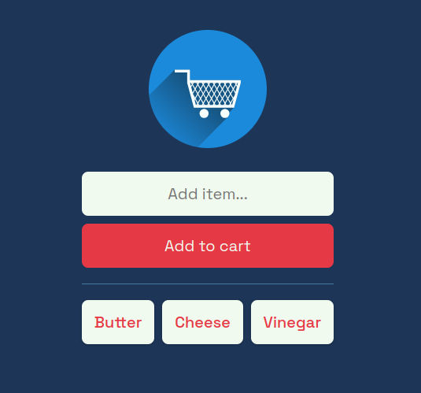
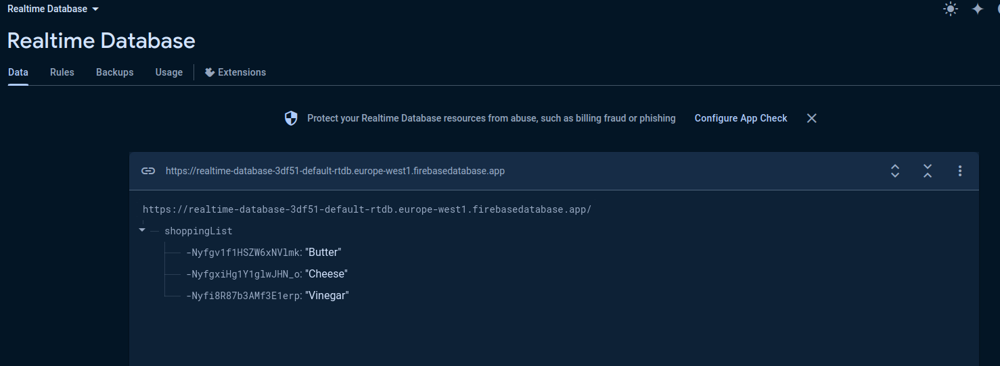

# Add to cart

Add-to-cart application made using HTML, CSS and vanilla JS and Firebase as a backend.

## Frontend

## Database

## Hosted site

View hosted site [here](https://jarabi.github.io/add-to-cart/)